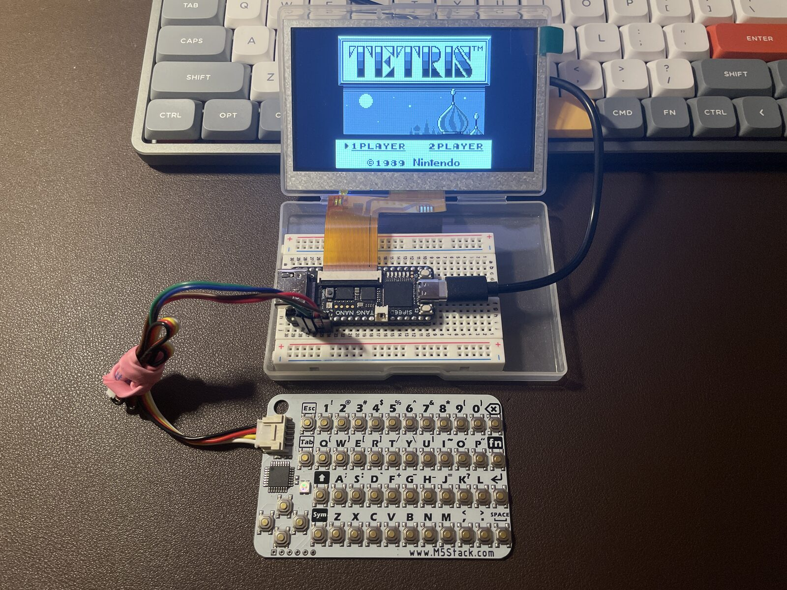
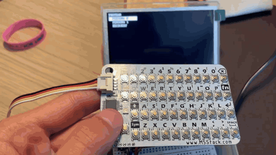
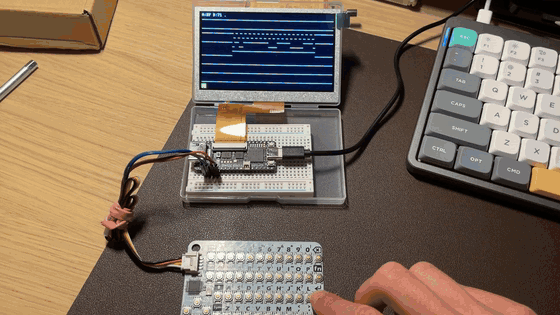
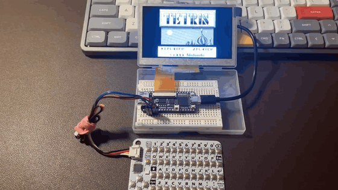

# Protean

An FPGA cyberdeck that reconfigures its own fabric.

Most handheld "decks" are a small Linux computer running different apps. Protean is the other thing: it runs on a Sipeed Tang Nano 20K, and instead of swapping software on a fixed CPU, it loads a different bitstream and the chip *becomes* a different device. Right now it can turn into a logic analyzer or a Game Boy, chosen from a menu on the screen.

It's all built with an open-source FPGA toolchain (yosys, nextpnr, apicula, openFPGALoader) — no vendor EDA anywhere in the flow. This is a learn-by-doing project to familiarize myself further with Verilog and interfacing with peripherals through different communication protocols;



## What works now

A small RISC-V soft core (picorv32) boots as the **shell** — a menu on the LCD that you drive with a little I²C keyboard. Pick a persona and the shell copies that bitstream into the boot region of the onboard flash and pulses the FPGA's reconfiguration pin. A fraction of a second later the chip comes back up as an entirely different design. Hold both buttons inside any persona and it does the reverse, dropping you back at the menu.

Three personas so far:

- **Shell** — the picorv32 SoC and menu launcher, built up from the gates.
- **Logic Analyzer** — samples 8 channels with a pre-trigger ring buffer, pans/zooms the captured waveform from the keyboard, and decodes the live I²C traffic from its *own* keyboard bus on screen.
- **Game Boy** — an original DMG running real cartridges, drawn to the LCD at 2×, played on the keyboard. The CPU/PPU core is the open-source [VerilogBoy](https://github.com/zephray/VerilogBoy); I wrote everything around it to make it a persona — clock, cartridge ROM, the framebuffer/video path, and the keyboard-to-joypad mapping.

### In action

**Switching personas from the menu**



**The Logic Analyzer decoding its own keyboard bus** — `A:BF` is the CardKB's I²C address, with the live waveform below



**The Game Boy running Tetris, played on the keyboard**



## How the switching works

The FPGA can only load its bitstream from the onboard SPI flash, so switching a persona means rewriting the flash boot region and reconfiguring:

```
power on → shell (menu) → pick a persona
                              │
        shell copies that slot's bitstream → flash boot region → RECONFIG_N
                              │
                         persona runs
                              │
              hold both buttons → copies the shell back → RECONFIG_N
                              │
                          back to menu
```

Each persona bundles a tiny fabric SPI-flash writer for the "escape back to shell" path, so no PC is involved once it's flashed.

## Hardware

- Sipeed Tang Nano 20K (Gowin GW2AR-18C)
- 4.3" 480×272 RGB LCD on the onboard 40-pin connector
- M5Stack CardKB — a card-sized QWERTY keyboard over I²C
- 3.7" e-ink HUD (driver written, not yet wired into the personas)

## Toolchain

Fully open source: `yosys` → `nextpnr-himbaechel` → `apicula` (`gowin_pack`) → `openFPGALoader`.

## Building

```bash
make soc         # build the shell + firmware, load to SRAM
make la          # build + load the Logic Analyzer persona
make gb          # build + load the Game Boy persona

make stage-shell # flash the shell into its persona slot
make stage-la    # flash the Logic Analyzer into its slot
make stage-gb    # flash the Game Boy into its slot
make detect      # openFPGALoader --detect
```

`make soc` / `la` / `gb` load to volatile SRAM for iterating; the `stage-*` targets write to flash so the shell menu can launch them. The Game Boy needs a ROM (see `personas/gameboy/roms/README.md`).

## Layout

```
protean/
├── personas/
│   ├── shell/          picorv32 SoC + menu launcher
│   ├── logic_analyzer/ sampler, trigger, capture, I²C decoder, LCD render
│   ├── gameboy/        VerilogBoy core (vendored) + the integration RTL
│   └── blinky/         the original reconfiguration spike
├── common/             shared RTL: picorv32, flash writer, SPI, LCD text, font
├── firmware/           C for the shell's soft core
├── sim/                iverilog testbenches
├── tools/              helper scripts (e.g. gb2hex.py)
└── Makefile            synth → P&R → pack → load pipeline
```

## Status / what's next

- The three-persona deck works end to end. Next up is an **SD-card persona library** so new personas can be dropped onto a card and launched without reflashing fixed slots.
- Adding a SBC like a Raspberry pi for 'on-the-fly' RTL generation through an LLM to adapt to different computationally intensive scenarios.

## Credits

- [VerilogBoy](https://github.com/zephray/VerilogBoy) — the Game Boy core
- [picorv32](https://github.com/YosysHQ/picorv32) — the shell's RISC-V core
- [yosys](https://github.com/YosysHQ/yosys), [nextpnr](https://github.com/YosysHQ/nextpnr), [apicula](https://github.com/YosysHQ/apicula) — the open Gowin toolchain
- M5Stack CardKB — the keyboard
